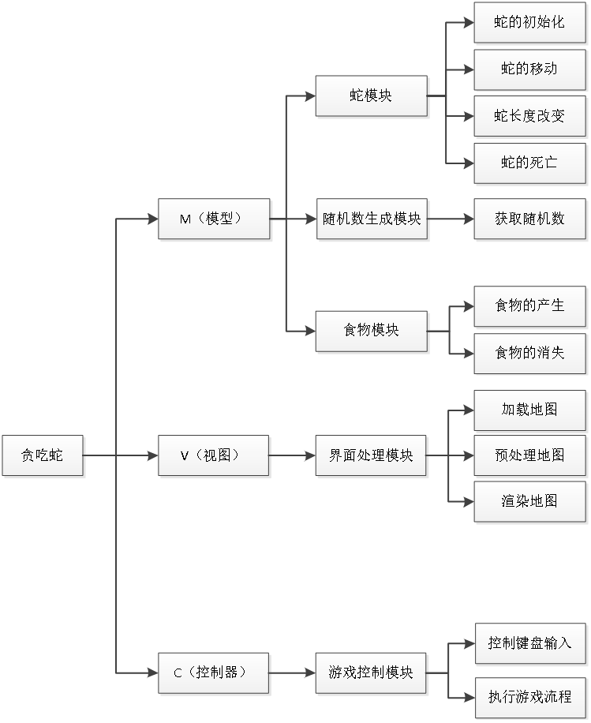

# Demo：贪吃蛇  

## 1、程序分析  

相信大家都知道贪吃蛇这款游戏，它是一款经典的手机游戏。通过控制蛇头方向吃食物，使得蛇变长，从而获得积分，既简单又耐玩。通过上下左右键控制蛇的方向，寻找吃的东西，每吃一口就能得到一定的积分，而且蛇的身子会越吃越长，身子越长玩的难度就越大，不能碰墙，不能咬到自己的身体，更不能咬自己的尾巴，等到了一定的分数，就能过关，然后继续玩下一关。  

### 模块设计  
在本游戏中，从键盘输入来获取移动方向和蛇的移动的关系  

  

## 模块描述  

蛇的初始化
蛇的初始化实际就是二维数组的初始化，该二维数组存储两个值，里面包含该蛇身体的坐标信息，它出现的初始位置是横纵坐标的中间位置。  

蛇的移动
蛇的移动是通改变二维数组坐标位置来实现的，例如当蛇向右前进一个单位，则将尾每一个身体位置的坐标更改，同时改变蛇头、蛇身以及蛇尾的方向。这样整体来看来蛇就前进了一个单位。  

蛇的增长  
当蛇吃了正常食物后，蛇的长度会增加，增加蛇的长度就是在食物的位置增加一个二维数组并且将这个位置变为蛇头。  

蛇的死亡  
当蛇撞上障碍物、自身或者通关时，蛇会死亡，蛇死亡就是二维数组的销毁。  

食物的产生  
食物出现的位置产生都是随机的，这些因素由通过随机函数获取的随机数决定。食物的位置不能出现在障碍物和边界上。  

控制键盘输入  
通过获取键盘输入的W/w(上)、 S/s(下)、 A/a(左)、 D/d(右)来改变蛇模块中移动方向，从而影响蛇的移动方向。  

### 项目分析
游戏界面显示之后，会根据读取的移动方向来控制蛇的移动，蛇移动之后会吃食物，食物被吃掉之后又会随机生成，然后刷新界面，将界面显示出来。
刷新界面时会判断蛇的状态，如果蛇死亡，则结束游戏；如果蛇胜利晋级则进入下一关，重新加载地图，显示新的一关的游戏初始界面；如果蛇没有死亡也没有晋级过关，继续本关游戏，则按照读取的键盘输入控制蛇的移动。  

## 项目实现  

### 项目创建  

蛇结构体  
用来存放蛇的长度和位置坐标  

蛇移动函数  
用来实现游戏的控制和判断  

显示游戏界面函数  
用来实现游戏的显示  

主函数  
用来实现游戏流程控制  

